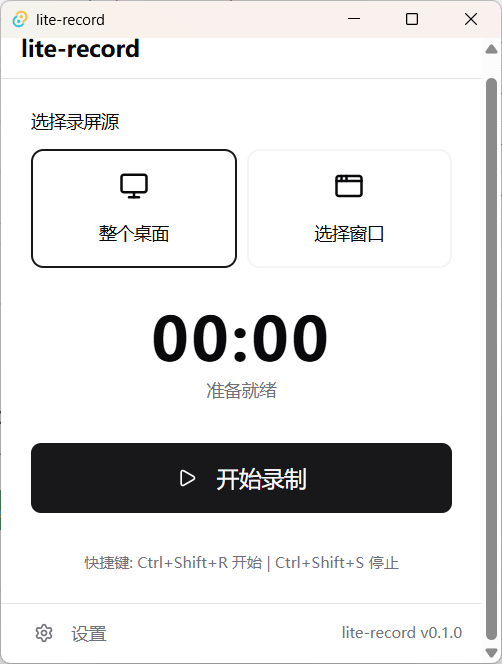
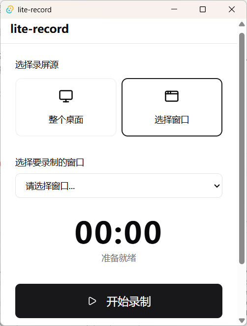

# lite-record

**Windows 轻量录屏工具。**

**理念：轻量、简洁、小巧。**

打开 → 选源 → 录制 → 保存。





## 特性

- **轻量**：Tauri + Rust 原生后端，安装包小、内存占用低
- **简洁**：核心操作一目了然，`Ctrl+Shift+R` / `Ctrl+Shift+S` 即开即停
- **小巧**：400×500 小窗口，托盘常驻，不占桌面空间

## 技术栈


| 层级  | 技术                                                                  |
| --- | ------------------------------------------------------------------- |
| 桌面壳 | [Tauri 2](https://tauri.app/)                                       |
| 录屏  | [windows-capture](https://github.com/NiiightmareXD/windows-capture) |
| 前端  | Vue 3 + Tailwind CSS                                                |


## 快速开始

**环境**：Node.js 18+、Rust 1.77+、Windows 10/11

```bash
npm install
npm run tauri:dev    # 开发
npm run tauri:build  # 打包
```

## 开发

```bash
npm run test         # 单元测试
npm run test:e2e     # E2E 测试
cd src-tauri && cargo test
```


## 交流与支持

欢迎反馈问题、交流使用体验或提出新功能建议。

[云雀坊间社区](https://contact.menghun3.cc/)

## 许可证

[MIT](LICENSE)